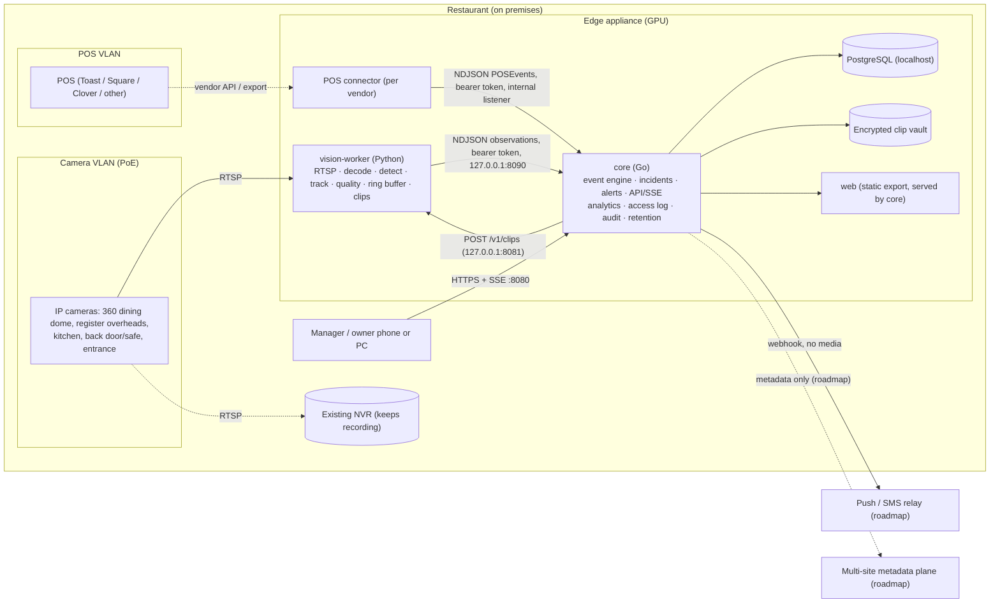

# 01-high-level

Source of truth: SYSTEM_ARCHITECTURE.md §3 (kept in sync).

```mermaid
flowchart LR
  subgraph Site["Restaurant (on premises)"]
    subgraph CAMV["Camera VLAN (PoE)"]
      CAM["IP cameras: 360 dining dome, register overheads,<br/>kitchen, back door/safe, entrance"]
    end
    NVR[("Existing NVR (keeps recording)")]
    subgraph POSV["POS VLAN"]
      POS["POS (Toast / Square / Clover / other)"]
    end
    subgraph EDGE["Edge appliance (GPU)"]
      VW["vision-worker (Python)<br/>RTSP · decode · detect · track · quality · ring buffer · clips"]
      CORE["core (Go)<br/>event engine · incidents · alerts · API/SSE<br/>analytics · access log · audit · retention"]
      CONN["POS connector (per vendor)"]
      PG[("PostgreSQL (localhost)")]
      EV[("Encrypted clip vault")]
      WEB["web (static export, served by core)"]
    end
    CAM -->|RTSP| VW
    CAM -.->|RTSP| NVR
    POS -.->|vendor API / export| CONN
    VW -->|"NDJSON observations, bearer token, 127.0.0.1:8090"| CORE
    CONN -->|"NDJSON POSEvents, bearer token, internal listener"| CORE
    CORE -->|"POST /v1/clips (127.0.0.1:8081)"| VW
    CORE --> PG
    CORE --> EV
    CORE --> WEB
    MGR["Manager / owner phone or PC"] -->|"HTTPS + SSE :8080"| CORE
  end
  CORE -->|"webhook, no media"| RELAY["Push / SMS relay (roadmap)"]
  CORE -.->|"metadata only (roadmap)"| CLOUD["Multi-site metadata plane (roadmap)"]
```
