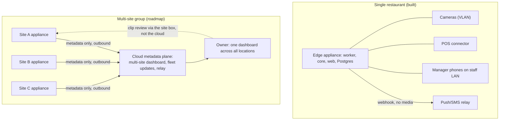

# 08-deployment-topologies

Source of truth: SYSTEM_ARCHITECTURE.md §11 (kept in sync).

```mermaid
flowchart TB
  subgraph Single["Single restaurant (built)"]
    S1["Edge appliance: worker, core, web, Postgres"] --- S2["Cameras (VLAN)"]
    S1 --- S3["POS connector"]
    S1 --- S4["Manager phones on staff LAN"]
    S1 -->|"webhook, no media"| S5["Push/SMS relay"]
  end
  subgraph Multi["Multi-site group (roadmap)"]
    M1["Site A appliance"] -->|"metadata only, outbound"| MC["Cloud metadata plane:<br/>multi-site dashboard, fleet updates, relay"]
    M2["Site B appliance"] -->|"metadata only, outbound"| MC
    M3["Site C appliance"] -->|"metadata only, outbound"| MC
    MC --> OWN["Owner: one dashboard across all locations"]
    OWN -.->|"clip review via the site box, not the cloud"| M1
  end
```

Video and clips stay on each site's appliance in both topologies.
